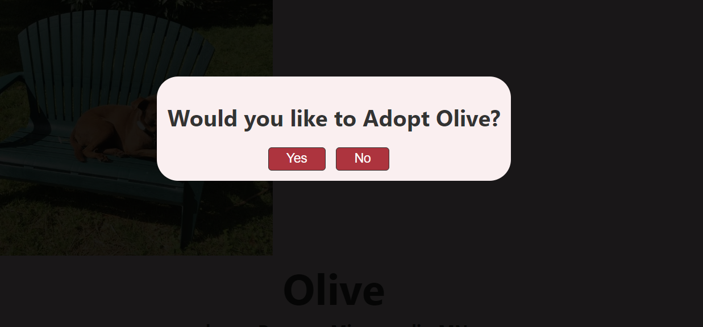

09876543210987654321 Adopt-Pet-MK

## => Adopt-Pet-SSR is a dynamic web application that incorporates Server-Side-Rendering (SSR). By rendering components on the server before sending them to the client, it ensures faster initial page loads and improves search engine optimization. Experience the benefits of server-side rendering in this innovative React project.

## Website Link => https://adopt-pet-mk.vercel.app/

## Website Link => https://adopt-pet-mk.netlify.app/

## Project's Screenshots =>




<h2>Getting Started</h2>

1. To get started with this project, you will need to have `Node.js` and `NPM` installed on your system.

2. First, you need to open a `Terminal` in your system and `Clone` this repository by using :

```bash
git clone https://github.com/Mk4Levi/Adopt-Pet-MK.git
```

3. Navigate to the Project's directory :

```bash
cd Adopt-Pet-MK
```

4. Install all Dependencies used in this Project :

```bash
npm install
```

7. Finally, host it on local server :

```bash
npm run dev
```

8. Now just search this link in your browser to view the live running application in your Local sysytem :

```bash
http://localhost:5173
```

<h2>Paths & Files</h2>

### Structure of the Folders & Files in this Repo :

```text
.
├── public/
├── src
│   ├── assets/
│   ├── components/
|         └── MemberCard.jsx
|         └── Form.jsx
|         └── MangaCard.jsx
│         └── Navbar.jsx
│         └── PreLoader.jsx
│         └── Socials.jsx
|         └── RecommendationCard.jsx
│         └── index.js
│
│   ├── config/
|         └── firebaseConfig.js
│         └── index.js
│
│   ├──  css/
│         └── Home.css
|         └── Navbar.css
|         └── AboutMe.css
│         └── Recommendation.css
|         └── Manga.css
|         └── Characters.css
|         └── Members.css
|         └── Register.css
│         └── Socials.css
│         └── PreLoader.css
│         └── App.css
│         └── index.css
│
│   ├── database/
|         └── data.js
│         └── images.js
|         └── index.js
|
│   ├── App.jsx
│   ├── index.jsx
│   ├── vercel.json
│
├── .eslintrc.json
├── .gitattributes
├── .gitignore
├── index.html
├── package-lock.json
├── package.json
├── README.md
├── vite.config.js

```

## Thank You
